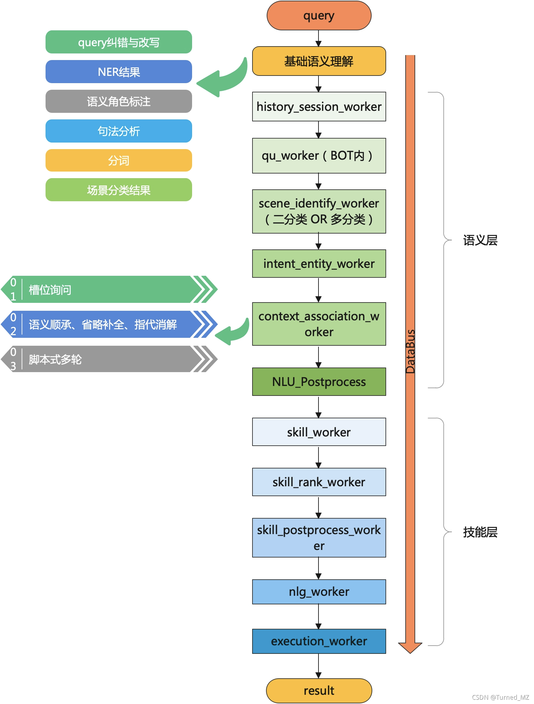

# 十三、语音助手——指令型助手架构和设计

​		这一章我们来一起看一下语音助手中，指令型（任务型）助手的整体架构和设计。

### 一、指令型助手的应用场景

​        在这里，如果助手的作用是帮助用户实现某些操作，比如：语音定闹钟，语音听歌，语音导航等等，那么实现这一类任务的助手我们叫做指令型语音助手，即用户通过语音来下发某些指令，助手根据指令进行操作，从而实现解放双手，快捷操作的目的，比如下面的几个例子：

---

### 二、指令型助手架构和设计

​    我们在前面章节《语音助手整体架构和设计》中有讲到，指令型助手中各个垂类作为BOT的形式存在，BOT内自成一个小周天，各个模块皆具备，如下图则为一个BOT的整体架构和设计：

​		如上图，在BOT中存在各个worker，分别负责处理不同的任务，worker之间不直接通信，而是通过DataBus来进行数据传递，因此，worker与worker之间是完全相互独立的，只需要满足DataBus中的接口定义，即可实现数据传递，这样的设计，可以使worker可以独立迭代，分模块开发。

​		**下面来分开看下各个worker的作用：**

#### 1、基础语义理解

​    	这里的基础语义理解，指的是对于输入query的一些基本处理，比如NER、句法分析、分词、场景分类，纠错等等，这一步一般由外部的DM中公共模块处理，传入到BOT中。

#### 2、history_session_worker

​		此worker主要用于处理历史信息，包括获取全局对话历史信息，该BOT相关历史信息等，一般如果是开放式多轮，则需要全局对话历史信息，如果是封闭式多轮，则一般需要该BOT相关历史信息。

#### 3、qu_worker（BOT内）

​		此worker和外部DM中的qu模块有区别，外部的qu模块用于处理基础语义理解，其识别的内容会无差别的共享给各个激活的BOT，而BOT内部的qu_worker则专门处理该worker特有的qu信息（如果需要的话），举个例子，如果有个针对闹钟场景的query改写，则在这里生效。

#### 4、scene_identify_worker

​		此worker一般是多分类或者二分类，我们之前说过，每个BOT需要具备“识别进入的query是否属于该BOT”的能力，因此该worker主要实现的功能为排除掉不属于该场景的query，DM中的场景分类模型重召回，因此对于部分BOT间模糊的话术会误召回，此时该worker中的分类则需要重准确，能够提高准确率。当然，除了这个功能外，也可以实现为多分类，为下方的worker提供信息。

#### 5、intent_entity_worker

​		此worker主要用于识别意图，提取槽位，其内部实现可以根据BOT类型来实现，一般来说有几种：模板、模型（意图槽位模型）、模板+模型、语义角色标注等等。

#### 6、context_association_worker

​		此worker用于实现多轮会话的能力，一般包含：封闭式多轮即槽位询问，开放式多轮即语义顺承、省略补全、指代消解，脚本式多轮。

#### 7、NLU_postprocess_worker

​		此worker用于对语义内容进行后处理。 此worker之前（包含此worker）的内容，我们都划分为语义层，即这里识别的内容都为纯语义的结果，即query本身具备的语义。 区别与下方的技能层，有时根据产品需求，需要将部分语义执行特殊的技能，比如：query：“搜索洗面奶”，该query的语义为“搜索物品”，如果此时物品为商品，则需要执行购物技能。如果直接将该query划分给购物的语义，和“在淘宝中购买洗面奶”同等处理的话，则可能造成该BOT的误召回。

​		因此，将query根据语义进行划分，每种不同类型的语义可以分别迭代效果，以及根据不同语义针对性的进行一些处理，比如上面的例子，如果query为“搜索xxx”，则需要结合知识图谱判断“xxx”是否为商品，如果是商品则走购物，否则走百科； 如果query为“在淘宝中购买xxx”，则不管“xxx”是什么，都需要走购物。

​		该worker中，一般实现实体消歧、实体校验等语义层面的后处理。

#### 8、skill_worker

​		这里进入了技能层的第一个worker，即将语义结果映射为技能，这里一般会维护一个映射表，映射语义-技能。

#### 9、skill_rank_worker

​        这里实现BOT内不同skill之间的排序，举个例子，在地图BOT内，query：“xxx在哪”，此语义会映射为两个技能：1、“在地图中搜索xxx”。2、“出百科卡片显示xxx的介绍”。这两个技能会根据"xxx"的类型进行排序，如果“xxx”为景点，则出技能2，如果“xxx”为普通地点，则出技能1。

#### 10、skill_postprocess_worker

​    	这里实现对于skill的后处理，比如query：“今天天气怎么样”，在识别到语义并映射为“查询天气”技能后，可以在此worker中访问天气服务器，获取天气信息，封装为卡片的形式，下发给客户端。

#### 11、nlg_worker

​        这一步一般用于生成nlg话术，在技能型BOT中，一般nlg都是基于模板配置的，根据slot、intent以及context信息，不同的组合生成不同的回复话术。在闲聊BOT或者问答BOT中，此worker可以替换为生成模型或者检索模型来生成回复。

​		一般推荐内容也在这里获取，比如：query：“今天天气怎么样”，获取推荐内容：“明天呢”、”今天适合穿什么“等

#### 12、execution_worker

​		这里主要用于最终的结果封装，封装为结构化的数据，返回给外部的DM。

### 三、写在后面

​        上述的架构形式，可以实现将BOT内各个环节细化、分解，各个worker之间相互独立，可以由不同的负责人独立负责开发、升级。同时BOT与BOT之间也相互独立，可以独立升级，个别worker或者BOT错误，不一定会影响全局的结果（注意这里是”不一定“，即在一定程度上提升了系统的鲁棒性，但是可能会导致最终结果不是最优的）。

​		由于各个worker之间相互独立，只通过data_bus进行通信，因此理论上可以设计为通过RPC或者http的形式通信，这样就可以真正实现worker的独立升级。但是这样会增加网络开销，可能导致系统性能降低    

————————————————
版权声明：本文为CSDN博主「Turned_MZ」的原创文章，遵循CC 4.0 BY-SA版权协议，转载请附上原文出处链接及本声明。
原文链接：https://blog.csdn.net/mingzheng114/article/details/120982138
