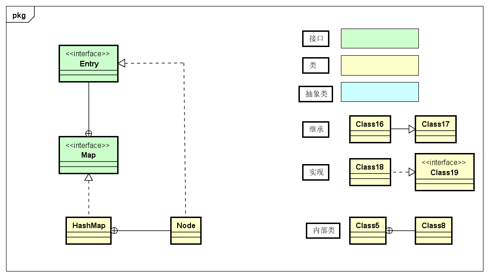
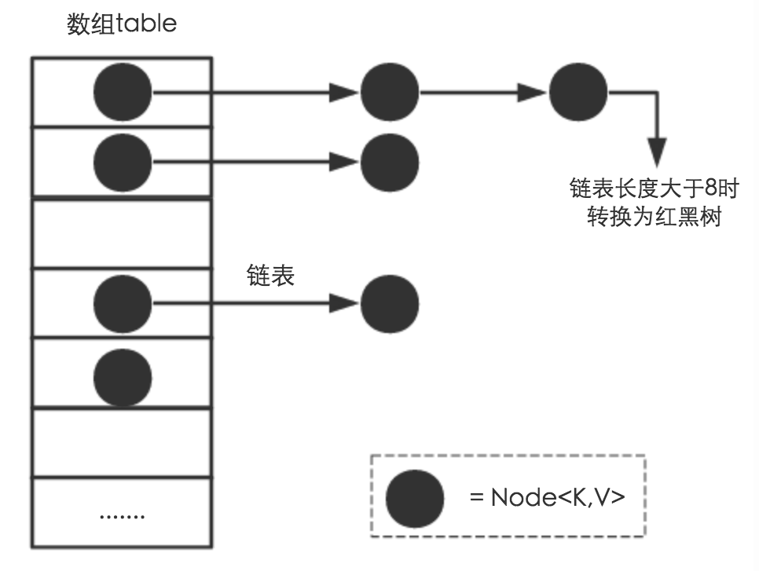

###### [Java 8系列之重新认识HashMap](https://tech.meituan.com/2016/06/24/java-hashmap.html)

## HashMap的原理与实现

> map n. 图，  mapping  adj.  映射

##### 版本之更迭：

-> **JDK1.7 :Table数组 + Entry  链表**

-> **JDK1.8 :Table数组 + Entry  链表/红黑树**

Entry  链表 在在HashMap中的实现类是Node，源码如下：

```java
Node(int hash, K key, V value, Node<K,V> next) {
    this.hash = hash;   // key 的hash 值？
    this.key = key;     // 节点key 
    this.value = value; // 节点的具体值
    this.next = next;   // 指向下一个Node 节点的指针
}
```

一问HashMap的实现原理

- 你看过HashMap源码吗，知道底层的原理吗
- 为什么使用数组+链表
- 用LinkedList代替数组可以吗
- 既然是可以的，为什么不用反而用数组。

##### 重要变量介绍：


内部实现

想要搞清楚HashMap，首先要知道HashMap是什么？即他的数据存储结构，其次要搞明白他能干什么，即内部功能是如何实现的？

#### 数据存储结构

从数据结构实现上来讲，HashMap的实现是 数组 + 链表 + 红黑树的实现，如下图所示：



想高清这个结构，需要先高清两个 问题：底层数据到底存储是什么？这样存储的方式有什么优点 ？

(1) 从源码可知，HashMap类中有一个非常重要的属性，就是上面提到的**数组**

```java
/**
 * The table, initialized on first use, and resized as necessary. When allocated, length is always a power of two.
 * 表，在第一次使用时被初始化，并根据需要调整大小。当分配时，长度总是二的幂。
 */
transient Node<K,V>[] table;
```

Node是HashMap的一个内部类，实现了Map.Entry接口，本质是就是一个映射(键值对)。上图中的每个黑色圆点就是一个Node对象。

(2) HashMap就是使用哈希表来进行存储的。为了解决Hash冲突问题，Java 中的HashMap 采用了链地址法，简单来说就是 数组 + 链表的结合。

**链地址法其实就是HashMap中用的策略。原理是在HashMap中同样哈希值的位置以一串链表存储起来数据，把多个原始值不同而哈希结果相同的数据以链表存储起来。hashmap既是该种处理办法。**

在每一个数组元素上都有一个链表结构，当数据被Hash后，得到数组下标，把数据放在对应下标元素的链表上。比如程序执行一下代码：

```java
map.put("key","Value")
```

查看一下`put` 方法的内容：

```java
public V put(K key, V value) {
    return putVal(hash(key), key, value, false, true);
}
```

可以看到在调用`putVal`前，先执行了一次`hash(key)`操作得到其hashCode 值（该方法适用于每个Java对象），

然后再通过Hash算法的后两步运算(高位运算和取模运算，下文有介绍)来定位该键值对的存储位置，

有的时候两个key会定位到同一个位置，就是所谓的Hash碰撞(冲突)，当然Hash算法计算结果越均匀分散，Hash碰撞发生的几率就越低，Map的存取效率就越高

同时影响Hash冲突几率的另一个因素就是 哈希桶数组 的大小，即Node table 的大小，如果哈希桶数组很大，即使是较差的Hash算法也会比较分散，如果哈希桶数组数组很小，即使Hash算法很棒，也会出现较多的HashMap冲突，所以这时就需要对时间成本和空间成本进行权衡，权衡方式就是根据实际存储情况实时修改 哈希桶数组 的大小，并在此基础上优化Hash算法以减少Hash冲突，

那么通过什么方式来控制map能使得Hash冲突概率低的同时，哈希数组桶(Node<K,V>[] table)占用空间又小呢？

> **答案就是优秀的Hash算法和扩容机制**

在了解HashMap 的扩容机制前，先了解一下HashMap类中的几个关键属性字段和构造方法：

```java
    transient Node<K,V>[] table;    // 哈希数组桶
    transient int size;				// size这个字段其实很好理解，就是HashMap中实际存在的键值对数量。
    transient int modCount;			// 记录HashMap内部结构发生变化的次数,例如put新键值对，但是某个key对应的value值被覆盖不属于结构变化。
    int threshold;  				// 最多容纳的Node 节点个数
    final float loadFactor;			// 负载因子
    public HashMap(int initialCapacity, float loadFactor) { ******* } // 创建HashMap时可以直接设置，table 长度和 负载因子
```

* HashMap 构造是不传递负载因子和初始数组长度的话，会在第一次put 是 进行扩容，

* table的初始化长度length(默认值是16)，Load factor为负载因子(默认值是0.75)，

* threshold 是HashMap 所能容纳的最大数量的Node个数，即threshold  = length * loadFactor，当Node个数超过threshold  ，就会进行扩容，扩容后的HashMap容量是之前容量的两倍

* 默认的负载因子是0.75，是对空间和时间效率的一个平衡选择，建议不要修改，除非在时间和空间比较特殊的情况下

  * 比如内存非常充足同时要求较高的时间性能，可以降低loadFactor 负载因子的值，
  * 相反，内存空间紧张而对时间效率要求不高，可以增加负载因子loadFactor的值，这个值可以大于1。

* 在HashMap 中 Hash桶数组的长度length大小必须是2的n次方，这是一种非常规设计，常规设计是桶的大小设计成素数。相对来说素数大小导致的冲突会小于合数，具体证明可以参考[:link:这篇文章](http://blog.csdn.net/liuqiyao_01/article/details/14475159) 。HashTable初始化时哈希桶大小是11，就是桶大小设计为素数的应用（Hashtable扩容后不能保证还是素数）。HashMap采用这种非常规设计，主要是为了取模和扩容时做优化而减少冲突，HashMap定位哈希桶索引位置时，也加入了高位参与运算的过程。

* 这里存在一个问题，即使负载因子和Hash算法设计的再合理，也避免不了Node链表变长的情况，一旦链表过长，会严重影响HashMap的性能。所以在JDK1.8中，对数据结构进行了进一步的优化，引入红黑树，当链表的长度大于 8 (默认值)时，链表就转换为红黑树，利用红黑树快速增删改查的特点提高HashMap的性能，其中会用到红黑树的插入、删除、查找等算法。本文不再对红黑树展开讨论，想了解更多红黑树数据结构的工作原理可以参考[这篇文章](https://tech.meituan.com/2016/12/02/redblack-tree.html)

  

#### 功能实现-方法


