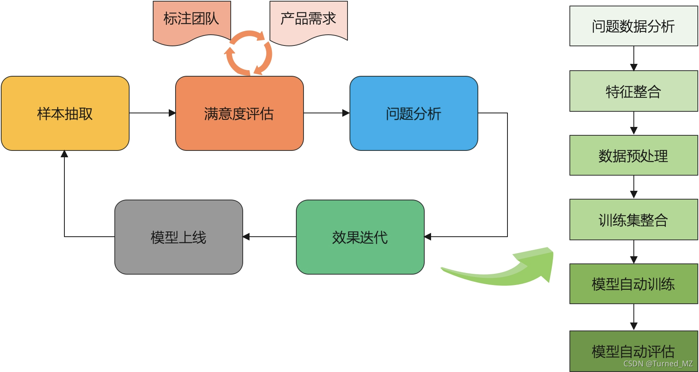
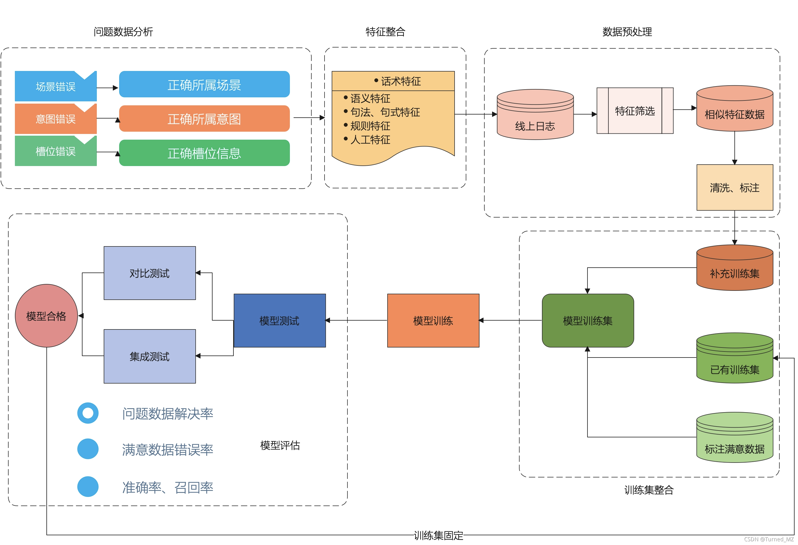

# 语音助手——垂类永动机——自动化迭代框架

这一章我们一起来看一下语音助手中的自动化迭代框架，这里的自动化迭代是任务型语义的自动化迭代。

### 一、为什么需要自动化迭代框架

​        首先，为什么需要自动化迭代框架呢？随着业务的发展，产品需求越来越多，语音助手中覆盖的技能也越来越多，大概有40+垂类，为了能够给用户带来更好的体验（提高日活和留存），需要对这些垂类有一个效果的评估机制，因此，我们建立了满意度评判系统：随机抽取线上日志，进行人工check，评判nlu结果是否正确，当垂类、意图、槽位、结果均正确时，则认为该条话术nlu结果正确。经过这个系统评判之后，我们发现，Top20垂类的垂类准确率只有70%，满意度（即加权准确率只有80%）.

​    	除满意度之外，我们还对大盘日志做了整体分析，发现每天有约80%的query是昨天没有出现过的，约60%的query是上个月全月没有出现过的，即：如果不进行迭代，随着用户话术不断更新，垂类覆盖率也会逐渐降低，用户满意度自然也会逐渐降低。

​    	如何建立一个流程或者框架，可以实现垂类的自动化迭代呢？垂类永动机项目应运而生。

### 二、垂类迭代流程

​		首先需要梳理一下垂类迭代的流程，如下图：

​	     整个垂类迭代流程分为：**样本抽取，满意度评估，问题分析，效果迭代，模型上线五个步骤**。其中样本抽取为按照线上数据分布随机抽取的日志信息，满意度评估则根据产品需求制定标注规则，由标注团队进行标注，标注后得到的不满意数据则进入问题分析阶段。

​	    问题分析中，我们梳理出了几种问题类别，包括：**场景错误、意图错误、槽位错误、ASR错误、推荐错误、资源错误**等。其中场景错误、意图错误、槽位错误占比最多，这也是需要模型迭代来主要解决的问题。

​	    效果迭代中，见上图右半部分，又分为问题数据分析、特征整合、数据预处理、训练集整合、模型自动训练、自动评估几个步骤。

​	    经过迭代和评估之后得到的最终模型，则进入上线阶段，然后又回到样本抽取，如此循环，形成闭环。

### 三、自动化迭代框架

​		将上面的效果迭代流程进一步细化，得到下方的流程图：

​    	 **问题数据分析：**这一步需要分析问题数据，得到其正确的场景、意图、槽位信息，这一步一般需要人工分析，我们可以利用主动学习的思想，抽取少部分数据进行分析。

​    	**特征整合：**将分析得到的问题数据，进行特征抽取，这里可以抽取其语义特征、句法句式特征、规则特征、以及其他人工总结的特征，将所有的特征归结到一起，得到问题话术特征。

  	  **数据预处理：**利用整合后的特征，在线上日志库中进行特征筛选，挖掘与问题数据类似特征的数据，这一步主要为数据增强，将抽取到的数据进行清洗、标注。这一步我们可以利用噪声标签识别，或者教师模型伪标注的方案进行达标，得到补充训练集。

​		**训练集整合：**将处理过后的补充训练集，与已有的训练集、标注的满意数据进行整合，得到最终训练集。

​		**模型训练：**利用整合后的训练集，进行模型训练，如果为场景错误问题，则迭代场景分类模型；如果为意图错误或者槽位错误模型，则迭代场景意图模型。

​		**模型评估：**训练后的模型，需要进行评估，避免线上出现严重错误，评估过程分为对比测试和集成测试两部分，对比测试为新旧版本模型进行对比测试，查看diff率，分析diff数据中good，bad，same占比； 集成测试为将模型集成到语音助手系统中，跑全流程的测试。

​		测试方面主要为：

​		1、模型准召率对比；

​		2、问题数据解决率；

​		3、满意数据错误率；

  	 **模型合格：**评估合格后的模型，则需要进入上线阶段，进入下一个循环。同时需要将此过程中得到的“补充训练集”归入到“已有训练集中”，即训练集固定。方便下次模型训练时使用

### 四、写在后面：

​        利用上面的框架，可以有效的提升语音助手中垂类的整体满意度，我们将垂类准确率由70%提升至85%，用户满意度提升至94%，在半年的时间中实现了日活翻倍。在模型迭代中，也可以参考我的另外一篇文章：[业务场景算法落地 - 利用预训练&伪标注&蒸馏实现一个通用的分类模型baseline](https://blog.csdn.net/mingzheng114/article/details/115532141?spm=1001.2014.3001.5501)
————————————————
版权声明：本文为CSDN博主「Turned_MZ」的原创文章，遵循CC 4.0 BY-SA版权协议，转载请附上原文出处链接及本声明。
原文链接：https://blog.csdn.net/mingzheng114/article/details/120942352