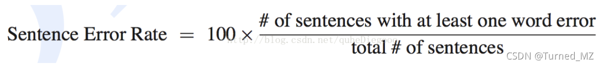

# 语音助手——评测指标

一个语音助手包含很多模块和环节，比如ASR、NLU、TTS、客户端等，那么如何评估一个语音助手以及其各个模块的效果呢？有没有可以量化的指标？

###  1、产品指标：

* 用户会话量：指每日用户对话次数。
* 用户量：指每日用户量。
* 次日留存：指次日仍然使用助手的用户相对于前一天的占比。
* 第7日留存：以n为基准，则第n+7天仍然使用助手的用户占比。
* 次周留存：以n为基准，n+7不算，从n+7到n+14内仍然使用语音助手的用户占比。

> 上述指标，是从不同的角度来对整个产品进行评估，其体现的是一个语音助手整体的状态，简单来说，就是用的人越多（用户量），每个人用的次数越多（用户会话量/用户量），用完了之后还想用（留存），就是一个好的产品。

### **2**、技术指标：

#### **客户端**：

- 客户端执行成功率：指客户端执行操作的成功率，越高越好。

#### ASR：

##### ASR字错率：

为了使识别出来的词序列和标准的词序列之间保持一致，需要进行替换、删除或者插入某些词，这些插入、替换或删除的词的总个数，除以标准的词序列中词的总个数的百分比，即为WER，越低越好。

.png)

##### ASR句错率：

SER表述为句子中如果有一个词识别错误，那么这个句子被认为识别错误，句子识别错误的的个数，除以总的句子个数即为SER，越低越好，其计算公式如下所示：

##### 唤醒率：

​		即用户唤醒成功的概率，越高越好。

##### 误唤醒率：

​		非用户唤醒，或者存在背景音等噪音时，被误唤醒的概率，越低越好。

> 以gaea 项目为例，唤醒率要求本地静态> 95%、本地动态 > 90% ，误唤醒率﹤1/4h。

#### **NLU：**

- 语义理解准确率：语义识别的意图、槽位、结果均正确时，认为语义理解正确，则准确率=识别正确的query/总query
- 召回率：能够正确识别用户话术到某个意图中，则为对应场景的召回率，召回率= 正确识别到该场景的话术/用户话术中存在该意图的话术。

#### **TTS：**

- TTS自然度：指TTS在播报时的流畅程度，更加贴近于人在说话，而非机器音，是一个偏主观的指标。

### 3、从用户侧角度出发：

#### **闲聊场景下：**

* 同情心：指识别用户情绪的能力，能够识别到用户当前情绪，也叫情感识别。
* 同理心：同理心要求从用户角度来看待事物，而非自己的角度，也就是指识别到用户情绪后，在回复中能够与用户共情，和用户引起共鸣。
* 相关性：指回答要和用户的问题相关，不能够答非所问，比如：Q：“今天天气怎么样？”A1：“今天有雨”。 A2: “今天8号”。则A1与Q相关，A2不相关。
* 趣味性：指回复的内容是否有趣味，而非仅仅“问什么答什么”，仍然上面的例子，A3：“今天有雨，出门记得带伞，即使下雨也要保持好心情哦。”，A3相对于A1趣味性更高，也是一个偏主观的指标。
* 多样性：指回复的内容是否丰富多样，当用户多次询问相同的问题时，回复不能够总是一样的。
* 平均对话轮次：指和用户总共对话的轮次，一般认为10分钟内没有和用户发生对话，则一轮对话已经结束，平均对话轮次=总对话次数/总轮次，比如：某天用户和助手一共对话100次，分别在上午8:00-8:30， 9:00-10:00, 10:15-11:00，则平均对话轮次=100/3 = 33次。
* 人设一致性：每个助手是有自己的人设的，比如：女性、18岁，喜欢吃白菜，喜欢绿色等等，人设一致性要求助手在与用户对话时，保持自己的人设不变的，不能“朝三暮四”。
* 开启话题的能力：指当某个话题聊不下去时，能够主动开启新话题的能力，不能够尬聊。

#### **问答场景下：**

* 回复相关性：指回复和用户问题是否相关。
* 时效性：指回复是否足够实时，比如股票信息，限号信息等，都是有实效要求的。
* 问题解决率：指回复能够解决用户问题的占比。
* 无答案的比例：指没有找到答案的占比，越低越好。
* 用户重复询问的比例：当用户没有找到自己的答案时，有时会重复询问这个问题，或者变换一种说法再次询问，则重复询问的比例要求越低越好，也就是希望能够一次性解决用户需求。

#### **指令场景下：**

* 技能覆盖率：指可以执行的技能覆盖用户需求的能力，用户的需求是多种多样的，是否存在对应的技能来执行，表示技能覆盖率。
* 完成度：指执行动作完成用户需求的程度，比如用户说：“打开微信帮我发个朋友圈内容是今天天气真好”，如果只帮助用户打开了微信，而没有发朋友圈，则该技能没有被完成。
* 执行成功率：指动作执行成功的占比。

### 4、更高的要求：

​        上面3点分别从**产品、技术、用户**的角度分析了一下语音助手的评测指标，但一个真正智能的语音助手，还应该具备多轮会话的能力，他作为闲聊、问答、任务之间的润滑剂，可以大大提升智能感，这在后面会细讲，对应的多轮对话的指标有：

* 平均对话轮次：计算方式和上面类似，但是不同场景要求不同，闲聊中要求平均对话轮次越高越好，说明聊的好，而问答型和任务型则希望对话轮次越少越好，表明在最短的时间内满足用户需求。
* 跳出率：指多轮对话之间用户跳出的占比。
* 多轮相关性：和回复相关性不同，如果定义一次Q和一次A为一轮，则多轮相关性则是指多个轮数之间的相关性，也指维护一个话题的能力。

————————————————
版权声明：本文为CSDN博主「Turned_MZ」的原创文章，遵循CC 4.0 BY-SA版权协议，转载请附上原文出处链接及本声明。
原文链接：https://blog.csdn.net/mingzheng114/article/details/120121572

