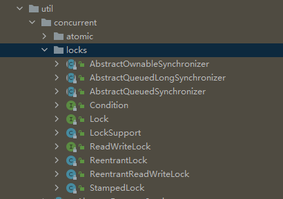
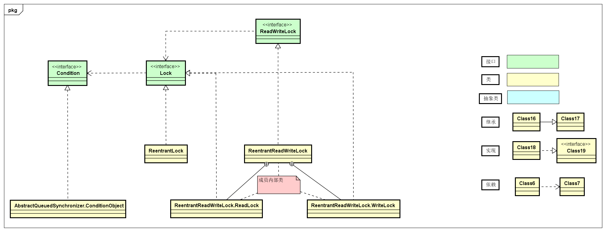

###### [不可不说的Java“锁”事-美团技术团队](https://tech.meituan.com/2018/11/15/java-lock.html)

https://tech.meituan.com/2019/12/05/aqs-theory-and-apply.html

↑ 基本讲清楚了，锁的分类和

###### [Java锁Lock的种类](https://segmentfault.com/a/1190000022456039)

↑ 表格形式区分类型

**[深入分析 Java Lock 同步锁](https://segmentfault.com/a/1190000038416906)**

---

# 锁的分类和Java Lock 框架

## 一、锁的分类


## 二、Java  Lock 框架

> Lock相关类和接口都在 `java.util.concurrent.locks`包中，一共只有10个文件，其中3个接口类，3个抽象类，4个实体类，如下图：



```java
java.util.concurrent.locks下的接口和继承类关系简易结构图：
```



### 2.1 Lock 接口

观察Lock 接口源码，

```java
public interface Lock {
	void lock();
	void lockInterruptibly() throws InterruptedException;
	boolean tryLock();
	boolean tryLock(long time, TimeUnit unit) throws InterruptedException;
	void unlock();
	Condition newCondition();
}
```

#### 2.1.1 lock()

#### 2.1.2 void lockInterruptibly() throws InterruptedException;

#### 2.1.3 boolean tryLock();

#### 2.1.4 boolean tryLock(long time, TimeUnit unit) throws InterruptedException;

#### 2.1.5 void unlock();

#### 2.1.6 Condition newCondition();


### 2.2 ReentrantLock 实现类

### 2.3 ReentrantReadWriteLock 实现类


### 2.4 Lock 和 Condition  的关系

https://www.cnblogs.com/noteless/p/10481286.html#6


| 实现类\分类            | **公平/非公平锁** | **可重入/不可重入锁** | **共享/独享锁** | **乐观/悲观锁** |
| ---------------------- | ----------------- | --------------------- | --------------- | --------------- |
| synchronized           |                   |                       |                 |                 |
| ReentrantLock          |                   |                       |                 |                 |
| ReentrantReadWriteLock |                   |                       |                 |                 |

**优缺点对比**

| 锁       | 优点                                                         | 缺点                                           | 适用场景                           |
| -------- | :----------------------------------------------------------- | ---------------------------------------------- | ---------------------------------- |
| 偏向锁   | 加锁和解锁不需要额外的消耗，和执行非同步方法相比仅存在纳秒级的差距 | 如果线程间存在锁竞争，会带来额外的锁撤销的消耗 | 适用于只有一个线程访问同步块的场景 |
| 轻量级锁 | 竞争的线程的不会阻塞，提高了程序的响应速度                   | 如果始终得不到锁竞争的线程，使用自旋会消耗CPU  | 追求响应时间，同步块执行速度非常快 |
| 重量级锁 | 线程竞争不使用自旋，不会消耗CPU                              | 线程阻塞，响应时间慢                           | 追求吞吐量，同步块执行速度较长     |
